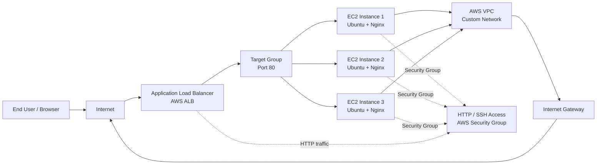

# Multi-Environment AWS Web Application Lab

This project demonstrates a clean Infrastructure as Code (IaC) deployment for a web application on AWS using Terraform. It provisions a custom VPC, public subnets, EC2 instances, and an optional Application Load Balancer (ALB) for production workloads across multiple environments.

## Overview

The lab is designed to simulate a realistic DevOps workflow with:

- Separate configurations for development and production
- Terraform workspaces for environment isolation
- Public-facing EC2 web servers running Ubuntu and Nginx
- Optional ALB and target group for production scaling and high availability
- Dynamic frontend content based on the active environment

## Architecture

### AWS Service Connectivity



### Terraform Deployment Flow

```mermaid
flowchart TD
    Dev[Developer] --> TF[Terraform Configuration]
    TF --> Vars[terraform.tfvars.dev / terraform.tfvars.prod]
    Vars --> WS[Terraform Workspace\n(dev / prod)]
    WS --> AWS[AWS Provider\nus-east-1]
    AWS --> VPC[Custom VPC + Subnets + IGW]
    AWS --> EC2[EC2 Instances]
    AWS --> ALB[Optional ALB in Prod]
    EC2 --> NGINX[Nginx Web Server]
    ALB --> NGINX
```

## Project Structure

```text
mse-project/
├── frontend/
│   ├── dev/
│   │   └── index.html
│   └── prod/
│       └── index.html
├── terraform/
│   ├── main.tf
│   ├── outputs.tf
│   ├── terraform.tf
│   ├── terraform.tfvars.dev
│   ├── terraform.tfvars.prod
│   ├── variables.tf
│   └── .terraform/   # local Terraform state/cache
├── terraform.tfstate.d/
│   ├── dev/
│   └── prod/
├── .gitignore
├── README.md
└── .terraform/
```

## Environment Behavior

### Development
- Single EC2 instance
- ALB disabled to reduce cost
- Simple environment-specific frontend page
- Designed for testing and validation

### Production
- 3 EC2 instances
- ALB enabled for load balancing and scaling
- Higher instance size and HA-ready architecture
- Production landing page and live traffic simulation

## Prerequisites

Before running the lab, ensure the following are installed and configured:

- AWS CLI v2
- Terraform v1.0+
- AWS account with valid credentials
- IAM permissions to create:
  - VPC
  - Subnets
  - Internet Gateway
  - Route Tables
  - EC2 instances
  - Security Groups
  - ALB and Target Group

### Configure AWS Credentials

```bash
aws configure
```

Or set environment variables:

```bash
export AWS_ACCESS_KEY_ID="your-access-key"
export AWS_SECRET_ACCESS_KEY="your-secret-key"
export AWS_DEFAULT_REGION="us-east-1"
```

## Terraform Configuration Details

### Core Terraform Files

- `terraform/variables.tf` — input variables for the environment
- `terraform/main.tf` — VPC, security group, EC2, and ALB resources
- `terraform/terraform.tf` — provider and Terraform version configuration
- `terraform/terraform.tfvars.dev` — development values
- `terraform/terraform.tfvars.prod` — production values
- `terraform/outputs.tf` — application outputs

## Deployment Workflow

### 1) Navigate to the Terraform directory

```bash
cd terraform
```

### 2) Initialize Terraform

```bash
terraform init
```

### 3) Check available workspaces

```bash
terraform workspace list
```

### 4) Create or select a workspace

For development:

```bash
terraform workspace new dev
# or
terraform workspace select dev
```

For production:

```bash
terraform workspace new prod
# or
terraform workspace select prod
```

### 5) Validate the configuration

```bash
terraform validate
```

### 6) Preview changes

Development:

```bash
terraform plan -var-file="terraform.tfvars.dev"
```

Production:

```bash
terraform plan -var-file="terraform.tfvars.prod"
```

### 7) Deploy infrastructure

Development:

```bash
terraform apply -var-file="terraform.tfvars.dev" -auto-approve
```

Production:

```bash
terraform apply -var-file="terraform.tfvars.prod" -auto-approve
```

### 8) View outputs

```bash
terraform output
```

### 9) Destroy infrastructure when finished

Development:

```bash
terraform destroy -var-file="terraform.tfvars.dev" -auto-approve
```

Production:

```bash
terraform destroy -var-file="terraform.tfvars.prod" -auto-approve
```

## Example Full Run Sequence

```bash
cd terraform
terraform init
terraform workspace select dev
terraform validate
terraform plan -var-file="terraform.tfvars.dev"
terraform apply -var-file="terraform.tfvars.dev" -auto-approve
```

For production:

```bash
cd terraform
terraform init
terraform workspace select prod
terraform validate
terraform plan -var-file="terraform.tfvars.prod"
terraform apply -var-file="terraform.tfvars.prod" -auto-approve
```

## Accessing the Application

After a successful deployment, use the output URL shown by Terraform:

```bash
terraform output
```

The output includes:

- application access URL
- individual instance IPs for direct access and troubleshooting

Example access pattern:

```bash
http://<alb-dns-name>
```

or directly:

```bash
http://<ec2-public-ip>
```

## Security Notes

This lab intentionally keeps the setup simple for educational use. The current implementation allows:

- HTTP access from anywhere on port 80
- SSH access via the security group rules defined in Terraform

For a production-grade environment, consider:

- restricting SSH source IP ranges
- using AWS Systems Manager Session Manager instead of direct SSH
- enabling HTTPS with ACM + ALB certificates
- implementing WAF and CloudFront in front of the application
- adding IAM least-privilege policies

## Recommended DevOps Flow

1. Validate configuration in development
2. Plan infrastructure changes
3. Apply only after review
4. Promote the same pattern to production
5. Destroy or tear down non-production workloads after testing

## Useful Commands

### Workspace and state management

```bash
terraform workspace list
terraform workspace select dev
terraform workspace select prod
```

### State inspection

```bash
terraform show
terraform state list
```

### Refresh and re-plan

```bash
terraform refresh -var-file="terraform.tfvars.dev"
terraform plan -var-file="terraform.tfvars.prod"
```

## Troubleshooting

### Terraform init fails

Check your Terraform installation and AWS provider plugin status:

```bash
terraform version
terraform init -upgrade
```

### Authentication issues

```bash
aws sts get-caller-identity
```

### EC2 not reachable

Verify:

- security group rules
- public subnet association
- instance state
- internet gateway attachment

### ALB not routing traffic

Verify:

- target group health checks
- instance port 80 listener status
- ALB security group configuration

## Summary

This project is a practical AWS lab for learning Terraform-driven infrastructure automation, multi-environment deployments, and basic cloud networking with EC2 and ALB. It provides a strong starting point for building more advanced DevOps architectures such as CI/CD pipelines, container orchestration, and automated cloud provisioning.

## License

This project is intended for learning and lab use.
